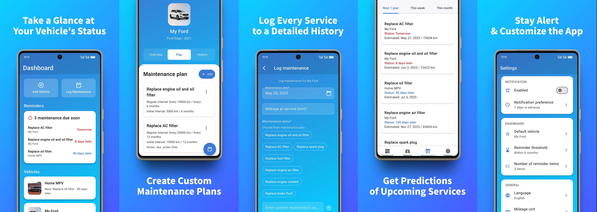

   
  
  &nbsp;
  
  &nbsp;
  
  &nbsp;
  
   
   

  

<h1 align="center">CarVita</h1>
<h3 align="center">Osobisty asystent do zarządzania i przewidywania potrzeb serwisowych Twojego pojazdu.</h3>

  <a href="../../README.md">English</a>
  &nbsp;|&nbsp;
  <a href="./README_zh.md">中文</a>
  &nbsp;|&nbsp;
  <a href="./README_pl.md">Polski</a>

## Co robi CarVita?

✅ **Wizualizacja stanu pojazdu:** Przejrzysty panel główny zapewnia szybki podgląd Twoich pojazdów oraz najpilniejszych nadchodzących czynności serwisowych.

✅ **Śledzenie wielu pojazdów:** Zarządzaj wszystkimi swoimi samochodami, motocyklami lub innymi pojazdami w jednym miejscu.

✅ **Tworzenie niestandardowych planów serwisowych:** Wprowadź zalecany przez producenta harmonogram przeglądów (zarówno interwały czasowe, jak i przebiegu, w tym wymagania dotyczące pierwszego serwisu), aby stworzyć plan dostosowany specjalnie do Twojego pojazdu.

✅ **Rejestrowanie każdej czynności serwisowej:** Prowadź szczegółową, cyfrową historię wszystkich przeprowadzonych czynności serwisowych, w tym daty, przebiegu, serwisowanych elementów, kosztów i notatek.

✅ **Prognozowanie potrzeb:** Aplikacja oblicza nadchodzące czynności serwisowe dla każdego elementu w planie, biorąc pod uwagę zarówno cykle czasowe, jak i przebieg, a nawet przewiduje terminy wykonania na podstawie Twoich nawyków związanych z użytkowaniem pojazdu.

✅ **Powiadomienia i przypomnienia:** Otrzymuj na czas lokalne powiadomienia o nadchodzących serwisach, dzięki czemu możesz bezstresowo zaplanować wizytę u mechanika.

## Jak zacząć

...lub pobierz plik instalacyjny bezpośrednio z sekcji [Github Releases](https://github.com/JeziL/carvita/releases/latest).

## Pomoc i wsparcie

W razie problemów prosimy o zgłoszenie błędu ( [issue on GitHub](https://github.com/JeziL/carvita/issues/new).

## Licencja

To repozytorium jest dostępne jako open-source na warunkach licencji [GNU AGPLv3 License](./LICENSE.txt).

Google Play jest znakiem towarowym firmy Google LLC.

  
  

W razie problemów prosimy o zgłoszenie błędu (<a href="https://github.com">Issue</a>) na GitHubie.
