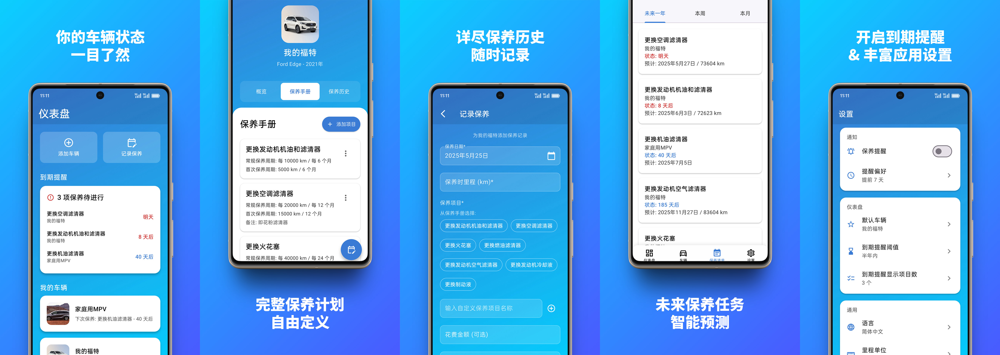

   
  
  &nbsp;
  
  &nbsp;
  
  &nbsp;
  
   
   

  

<h1 align="center">CarVita</h1>
<h3 align="center">管理和预测你的车辆保养需求</h3>

  <a href="../../README.md">English</a>
  &nbsp;|&nbsp;
  <a href="./README_zh.md">中文</a>

## CarVita 能做什么？

✅ **车辆状态一目了然：** 清晰的仪表盘让您对车辆和最紧急的保养项目一目了然。

✅ **跟踪多辆汽车：** 集中管理所有汽车、摩托车或其他车辆。

✅ **创建自定义保养计划：** 输入原厂推荐的保养手册（时间和里程间隔，包括首保要求），创建专为您的车辆定制的计划。

✅ **记录每次保养：** 保存所有保养的详细数字历史记录，包括日期、里程、保养项目、费用。

✅ **获得预测：** 为保养手册中的每个项目计算即将进行的任务，同时考虑时间和里程周期，甚至可以根据车辆的使用模式预测到期日期。

✅ **及时获取提醒：** 保养项目即将到期时，及时接收本地通知，让您可以毫无压力地安排预约。

## 开始使用

...或从 [Github Releases](https://github.com/JeziL/carvita/releases/latest) 下载。

## 帮助与支持

请提交 [GitHub issue](https://github.com/JeziL/carvita/issues/new)。

## 许可证

本代码库根据 [GNU AGPLv3 许可证](../../LICENSE.txt)条款开源。

Google Play 是 Google LLC 的商标。
