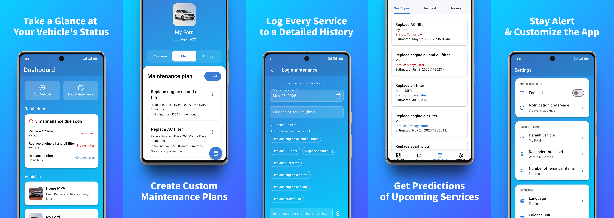

   
  
  &nbsp;
  
  &nbsp;
  
  &nbsp;
  
   
   

  

<h1 align="center">CarVita</h1>
<h3 align="center">Personal assistant for managing and predicting your vehicle's maintenance needs.</h3>

  <a href="./README.md">English</a>
  &nbsp;|&nbsp;
  <a href="./.design/i18n/README_zh.md">中文</a>

## What CarVita do?

✅ **Visualize Your Vehicle's Status:** A clear dashboard provides an at-a-glance overview of your vehicles and the most urgent upcoming services.

✅ **Track Multiple Vehicles:** Manage all your cars, motorcycles, or other vehicles in one place.

✅ **Create Custom Maintenance Plans:** Input your vehicle manufacturer's recommended service schedule (both time and mileage intervals, including first service requirements) to create a plan tailored specifically to your vehicle.

✅ **Log Every Service:** Keep a detailed digital history of all maintenance performed, including date, mileage, items serviced, costs, and notes.

✅ **Get Predictions:** Calculates upcoming maintenance tasks for each item in your plan, considering both time and mileage cycles, and even predicts due dates based on your vehicle's usage patterns.

✅ **Stay Alert with Reminders:** Receive timely local notifications for upcoming services, so you can schedule appointments without stress.

## Get Started

...or download from [Github Releases](https://github.com/JeziL/carvita/releases/latest).

## Help & Support

Please submit an [issue on GitHub](https://github.com/JeziL/carvita/issues/new).

## License

This repository is available as open-source under the terms of the [GNU AGPLv3 License](./LICENSE.txt).
