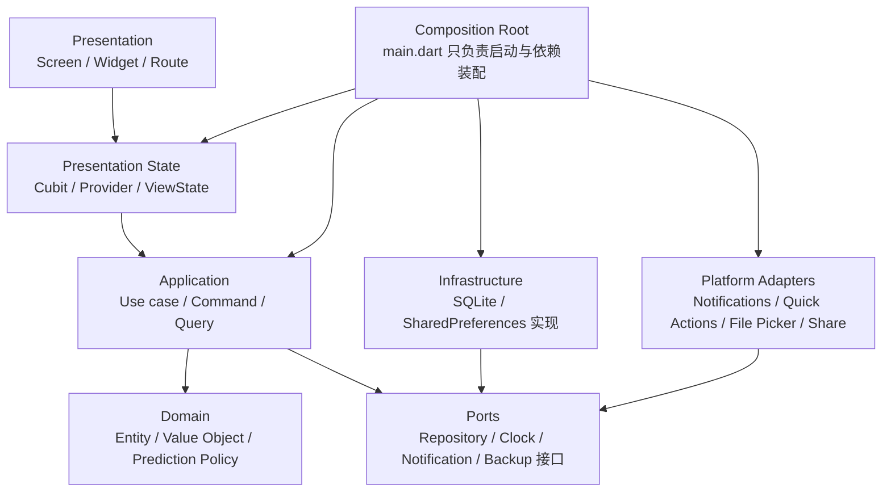

# CarVita 重构路线图与进度台账

> 建立日期：2026-07-26
>
> 适用范围：CarVita Android / Flutter 主仓库
>
> 当前阶段：第二阶段「边界清晰化与体验一致性」进行中
>
> 本文性质：架构目标、问题台账、实施顺序、验收门槛与决策记录的唯一跟踪入口

## 1. 目的与使用方式

本文把当前架构审计结论转化为可执行、可验收、可持续更新的重构计划。每项工作必须先在问题台账中有对应 ID，再进入实现；完成状态只以验收标准和真实验证结果为依据。

重构期间继续遵守以下项目边界：

- Android 是当前唯一发布目标，Flutter、Dart、Gradle、AGP、Kotlin 和核心插件不随业务重构一并升级。
- 应用保持离线优先，不引入遥测、远程同步或隐式网络上传。
- 保留现有用户数据和旧备份的可解释性，不以“清空重装”代替兼容设计。
- 用户可见行为必须同步考虑本地数据、预测、通知、国际化、主题和备份。
- 每个阶段只处理列入范围的事项，避免大面积横向改写。

### 状态定义

| 状态 | 含义 |
| --- | --- |
| 待办 | 已确认范围，但尚未开始实现 |
| 进行中 | 已有明确负责人并已开始设计、编码或测试 |
| 阻塞 | 依赖未满足；必须记录阻塞原因和解除条件 |
| 已完成 | 验收标准全部满足，并附有真实验证证据 |
| 延后 | 经决策明确移出当前阶段，不等同于遗漏 |

## 2. 已锁定的范围与约束

### 2.1 首保 UI 与兼容字段

首保周期输入 UI 是有意移除，不作为缺陷，也不在当前重构中恢复。

- 数据库和 Dart 模型中的 `firstIntervalTimeMonths`、`firstIntervalMileage` 暂时保留，用于兼容已有数据库和旧备份。
- 当前阶段不得删除、重命名、重解释或批量清空这些字段。
- 读取旧数据时仍应保持稳定；现有隐藏值不得因为编辑普通保养周期而被意外覆盖。
- 如果未来决定恢复首保 UI 或彻底移除字段，必须另立产品决策，并与 schema 迁移、备份兼容和预测规则一起设计。

### 2.2 第一阶段 schema 冻结

第一阶段不得修改 SQLite schema 或数据库版本：

- `DatabaseHelper` 的 schema version 保持为 1；
- 不新增或删除表、列、索引、约束和 trigger；
- 不新增 `onUpgrade`；
- 不对现有数据库或备份执行数据迁移；
- 可以调整查询结果映射、DTO、repository、service、Cubit 和 UI，但不得改变落盘结构；
- 备份重构可以增加只读校验、临时文件、回滚和原子替换流程，但不得把旧库转换成新格式。

### 2.3 外键启用延后

`PRAGMA foreign_keys = ON`、孤儿记录清理和级联语义统一延后到后续迁移阶段。原因是现有库可能包含历史不一致数据，直接启用外键会改变删除行为，并可能让旧库或旧备份无法打开或写入。

在迁移阶段开始前，任何代码都不得假定 SQLite 外键级联已经生效。当前需要删除关联数据时，继续使用显式、可测试的事务逻辑。

### 2.4 当前手工备份边界

第一阶段继续使用裸 SQLite `.db` 文件作为手工备份格式。该格式只包含四张业务表，不包含 `SharedPreferences`，因此语言、主题、自定义主题色、里程单位、默认车辆、通知开关、提前提醒天数和 Dashboard 筛选不会随备份恢复。

- 第一阶段的 `BackupService` 只安全化现有数据库备份，不得静默把偏好写进 `.db`、旁路文件或未版本化压缩包；
- 当前 UI、帮助和隐私说明必须清楚表达“业务数据库备份”与“完整应用设置备份”的区别；
- 未来若提供完整备份，应采用有 `formatVersion` 的版本化备份包，包含 manifest、数据库 schema version、应用版本、内容清单和校验值；
- 新格式必须保留裸 v1 `.db` 的导入能力，并为数据库与偏好的联合恢复设计 staging、校验和双向回滚；
- 里程单位和货币语义未确定前，不得把偏好简单打包后宣称可跨设备无歧义恢复。

### 2.5 Android 系统备份与隐私决策

ADR-009 已接受“禁止 Android 系统云备份和设备到设备迁移”的产品决策：

- Manifest 显式设置 `android:allowBackup="false"`；
- Android 11- 的 full-backup rules 与 Android 12+ 的 cloud/device-transfer extraction rules 排除全部可备份 domain；
- 用户需要副本时继续使用应用内手工业务数据库导出，不把 `SharedPreferences` 隐式加入裸 `.db`；
- Manifest、两代备份规则、应用内隐私页面和 Google Play Data safety 声明保持一致；
- 第一阶段已完成静态策略测试、真实设备验证和商店声明对照，不再依赖 Android 默认行为作为隐私保证。

## 3. 目标架构

目标是形成清晰的单向依赖，并把 UI 状态、业务命令、持久化和平台副作用分开。



### 3.1 分层职责

- **Presentation**
  - Widget 只负责渲染、输入收集和发送用户意图；
  - 不直接创建 repository、操作 SQLite 文件、调度通知或推断数据库关联；
  - 用户可见错误由本地化 failure mapper 生成，不直接展示 `e.toString()`。
- **Presentation State**
  - Query state 保存最后一次成功数据，不因短暂刷新或命令状态清空页面；
  - Command 返回显式 `Result`，调用方不再通过“当前 state 恰好是什么类型”判断写入是否成功；
  - 一次性导航、SnackBar 和对话框请求与持久列表 state 分离。
- **Application**
  - 车辆、保养计划、保养记录、全局预测、通知同步和备份恢复分别由 use case 编排；
  - 写入、局部刷新、全局预测刷新按一个明确顺序完成；
  - 并发刷新使用 generation token、互斥或串行队列，旧请求不得覆盖新结果。
- **Domain**
  - 模型和预测规则保持纯 Dart，不依赖 `BuildContext`、Widget 或生成的本地化类；
  - `Clock` 作为依赖传入需要“当前时间”的逻辑，便于日期边界测试。
- **Infrastructure / Platform**
  - repository 负责数据映射，不承载 Widget 文案；
  - 通知、快捷入口、文件选择、分享和应用退出通过可替换接口隔离；
  - `DatabaseHelper` 是存储实现，不再由 Screen 隐式实例化。
- **Composition Root**
  - `main.dart` 负责启动顺序、初始偏好读取和依赖注入；
  - 可恢复的插件初始化失败不得阻止基础 UI 启动；
  - locale 生效后再生成快捷入口和通知文案。

### 3.2 目标状态协议

写操作统一遵循：

1. UI 设置 `isSubmitting`，阻止重复提交；
2. 调用 application command；
3. command 在事务/仓储操作成功后，按顺序等待必要刷新；
4. 返回 `Success` 或 typed `Failure`；
5. UI 仅在 `Success` 时退出；失败时保留输入并显示本地化错误；
6. 通知同步作为可观察但不破坏业务数据 state 的后续任务执行。

查询统一遵循：

- 同一资源只有一个初始加载入口；
- refresh 保留旧数据并公开 `isRefreshing`；
- 旧 generation 的结果直接丢弃；
- route-owned Cubit 关闭后不得继续 emit；
- expensive refresh 不在 `build` 或无节制生命周期回调中触发。

## 4. 问题台账

> 第一阶段全部问题项已完成并通过退出验收；第二至第四阶段项目保持待办。

| ID | 优先级 | 阶段 | 状态 | 问题与范围 | 验收标准 |
| --- | --- | --- | --- | --- | --- |
| LOG-001 | P1 | 第一阶段 | **已完成** | 历史保养项目只保留显示名称，编辑时按名称反查计划 ID，可能把计划项改成 custom 或关联到错误的同名项 | 不改 schema/version；`ServiceLogWithItems` 携带 typed performed items（link ID、plan ID/custom name、display name）；查询完整映射关联；编辑页按持久化身份回填；软删除、同名计划、custom 重名和 plan 尚未加载均不改变身份；映射和编辑输入测试通过 |
| BKP-001 | P1 | 第一阶段 | **已完成** | 设置页直接操作数据库文件，职责耦合且恢复流程缺少独立可测边界 | 备份导入/导出职责进入独立 `BackupService`，Settings 只负责 picker/share/dialog；导出关闭连接后复制并校验快照，最终必定重开数据库；恢复文件通过 SQLite header、`PRAGMA integrity_check`、`user_version == 1` 及四张必需表/列校验；使用同卷 staging、rollback 副本和原子 rename，安装或重开失败自动恢复 rollback；失败通过 typed exception 表达，picker/share 取消留在 UI 边界；保持裸 `.db` 格式与 schema v1；真实 SQLite 和故障注入回滚测试通过 |
| BKP-002 | P2 | 第一阶段 | **已完成** | 当前手工备份只包含 SQLite 业务数据，不包含 `SharedPreferences`，但用户可能把它理解为完整应用备份 | 设置页保持简洁，不在导出/恢复入口堆叠内容范围清单；恢复确认和隐私页沿用原有面向用户的文案，详细内容边界只保留在技术文档；导入裸 `.db` 时不得覆盖当前偏好，成功恢复与失败回滚测试均证明偏好不变；不改变 schema 或裸 `.db` 格式 |
| PRIV-001 | P1 | 第一阶段 | **已完成** | 重构前 Manifest 未显式声明 `allowBackup`、`fullBackupContent` 或 `dataExtractionRules`，Android Auto Backup、设备迁移和厂商云备份的实际数据范围与“数据保存在本机”的隐私表述尚未形成产品决策 | 形成已评审 ADR；若禁止系统备份，显式关闭或排除数据库与敏感偏好；若允许，则明确数据范围和恢复语义；Android 12+ extraction rules、旧版 full-backup rules、Manifest、应用内隐私页和商店 Data safety 一致；在代表性 Android 版本验证备份/设备迁移行为；不改数据库 schema |
| STATE-001 | P1 | 第一阶段 | **已完成** | Vehicle/Plan/Log Cubit 写后未等待 refresh 就 emit success；车辆失败 error 还会被 Loading 覆盖 | command 返回显式结果；成功后等待刷新；失败不退出页面、不丢输入；列表保留最后成功数据；Cubit 状态时序测试覆盖成功、写失败、刷新失败 |
| FORM-001 | P1 | 第一阶段 | **已完成** | 新增/编辑表单没有提交锁，快速点击可产生重复记录 | 所有写表单具有 `isSubmitting`；提交期间按钮禁用并显示一致进度；双击 Widget 测试证明只调用一次 repository；返回仅发生于成功结果 |
| REFRESH-001 | P1 | 第一阶段 | **已完成** | 全局预测刷新和通知重排可并发，旧结果可覆盖新结果，交错的 `cancelAll`/schedule 可留下幽灵通知 | 同一时刻至多运行一次通知同步；并发请求合并为一次后续 latest-wins 重跑；每位 caller 等待包含其请求的同步完成；`cancelAll` 与整批 schedule 不交错；删除/编辑/设置变更并发测试无旧 state、无旧通知、无重复调度 |
| NOTIF-001 | P1 | 第一阶段 | **已完成** | 启动时从 `MaterialApp` 上方获取 l10n，通知调度被跳过；通知错误还会覆盖有效预测 state；一次性提醒被配置成按年重复 | 首次预测/通知加载发生在本地化就绪后且只触发一次；权限仅在用户启用开关时请求；提醒不带 recurrence match 参数；启用通知且数据库已有计划时，冷启动会同步计划；通知失败不把有效预测改成 error；通知服务测试验证 locale、lead time、关闭开关和冷启动单次调度 |
| BUILD-001 | P1 | 第一阶段 | **已完成** | 重构前 Android Gradle 在配置期强制读取 release 签名属性，debug 与 release 又共用 release signing config；没有发布密钥时，本地 debug 构建可能被无关签名要求阻塞 | debug 使用标准 debug 身份且无需 release secrets；release task 缺少或格式错误的签名配置时给出清晰、早失败的诊断；避免对 nullable key property 强制 cast；CI 不打印密钥；分别用 `apksigner verify --print-certs` 验证 debug/release 证书身份；密钥文件始终不入库 |
| CI-001 | P1 | 第一阶段 | **已完成** | 重构前 workflow 只由手工触发或版本 tag 触发，普通 PR/主分支变更没有持续质量门禁 | 新增不依赖签名 secrets 的 PR 与受保护分支检查：`flutter pub get`、`flutter gen-l10n`、格式检查、`flutter analyze`、`flutter test`，并在 BUILD-001 后加入可行的 debug APK 构建；使用最小权限和并发取消；required checks/分支保护配置有仓库侧验证记录 |
| RELEASE-001 | P1 | 第一阶段 | **已完成** | 重构前 tag 发布未校验 tag 与 `pubspec.yaml` version 一致，只检查英文 changelog，且在发布前缺少完整测试、版本递增和产物身份门禁 | 发布前验证 tag 精确等于 `v${pubspec version}`，例如 version `1.0.2+7` 只能由 `v1.0.2+7` 发布；versionCode 相对已发布版本单调递增；`en-US` 与 `zh-CN` 对应 changelog 均存在且非空；测试先于构建/发布；APK 路径、checksum 和签名身份可验证；任何门禁失败都发生在创建 Release 之前 |
| TOOL-001 | P2 | 第一阶段 | **已完成** | `pubspec.yaml` 声明 Dart `^3.7.2`，CI 固定 Flutter 3.44.8 / Dart 3.12.2；当前没有证据证明代码能在所声明最低 SDK 上构建，也没有显式的版本漂移检查 | 明确实际支持的最低 Flutter/Dart 组合：要么在最低声明版本运行分析/测试，要么收紧约束；CI 打印并校验 Flutter/Dart 版本；约束与 CI、开发文档一致；本项不夹带 Flutter/Dart/Gradle 升级 |
| NAV-001 | P1 | 第一阶段 | **已完成** | Quick Action 在 `runApp` 前注册并强制读取 nullable navigator context，冷启动存在崩溃竞态 | 初始 shortcut intent 先缓存，首帧和 Navigator 就绪后只消费一次；冷启动、热启动、重复 intent、无车辆、默认车辆失效测试通过；不使用强制 `currentContext!` |
| DETAIL-001 | P1 | 第一阶段 | **已完成** | 车辆详情在 loading/error/null 状态仍显示依赖 `_vehicle!` 的 FAB，且错误态没有可见返回/重试入口 | 只有车辆与页面 Cubit 就绪时才显示操作 FAB；loading/error/null 均无空值崩溃；错误态包含本地化返回与重试；Widget 测试覆盖慢查询和 null 结果 |
| PREF-001 | P2 | 第一阶段 | **已完成** | 默认车辆和语言对话框把 dismiss 返回的 null 当成“清除”或“跟随系统” | cancel/dismiss、clear/follow-system 使用可区分结果；遮罩和系统返回不改变偏好；Widget 测试覆盖已有非空选择 |
| LIFE-001 | P2 | 第一阶段 | **已完成** | 图片、日期、PackageInfo、通知开关等异步流程存在 dispose 后 `setState`/context 使用 | 所有跨 await UI 路径有 mounted 保护或移入 controller；移除 lint ignore；路由被 shortcut 清空、picker 返回较晚等测试不抛异常 |
| LOAD-001 | P2 | 第一阶段 | **已完成** | Plan/Log Cubit 构造器自动 fetch，多个路由又 cascade fetch；车辆列表也重复初始加载 | 每个资源只有一个初始加载入口；进入详情、快捷记录、车辆列表时 repository 调用次数测试为 1；无 close 后 emit |
| PRED-001 | P1 | 第二阶段 | 待办 | 车辆只有购入日期与当前里程，没有二手车购入里程、已知上次保养或“周期从何处起算”的显式语义；现有规则可能把整车累计里程误当作购入后里程 | 先通过 ADR 定义新车、二手车、历史未知、手工基线和最近保养的起算规则，并形成可复核示例；第二阶段只实现无需落盘的新策略与输入校验；若需要新增购入里程/基线字段，必须另入第四阶段 migration，禁止在第一阶段加列 |
| PRED-002 | P1 | 第二阶段 | 待办 | `MileageEstimator` 只比较排序后首尾里程，首尾仍增长时会掩盖中间某一段里程倒退、仪表更换或错误记录 | 明确逐段单调性、同日记录、仪表更换和数据修正规则；对每个相邻有效样本检查，遇异常按已决策策略使用最近有效段、拆段或回退，不得让负段被首尾净增长掩盖；覆盖中段倒退、多个倒退、零日差、同里程和恢复增长的纯 Dart 测试 |
| UNIT-001 | P1 | 第二阶段 | 待办 | 当前 km/mi 偏好只改变标签，不转换数值；费用是无币种的数值，跨 locale、设备或未来完整备份时可能被重解释 | 先决定里程单位是全局展示偏好还是每车持久业务属性，并定义现有无单位数据的迁移/转换规则；费用明确 ISO 4217 币种、精度/最小单位，或明确保持“无币种数值”的产品限制；locale 切换不得改变业务含义；禁止部分转换；如需新持久字段，统一延后第四阶段 |
| DATE-001 | P2 | 第二阶段 | 待办 | 到期天数按 `Duration.inDays` 截断，明天可能显示今天；购买/保养日期选择器允许明天 | 提供统一 calendar-day 工具；今天、明天、昨天、DST、跨月和时区边界测试通过；不允许未来业务日期 |
| ROUTE-001 | P2 | 第二阶段 | **进行中** | Router 在校验前强制 cast 动态 Map/Cubit 参数，错误参数直接 TypeError | 每条有参数路由使用 typed args；缺失/错误参数进入本地化错误页而非抛异常；所有 MaterialPageRoute 保留 RouteSettings；route 测试覆盖 |
| ERROR-001 | P2 | 第二阶段 | 待办 | repository/Cubit 的 `e.toString()` 和硬编码英文直接暴露给用户 | 定义 typed failure 与本地化映射；诊断详情只进入开发日志；12 个 locale 均有用户可理解错误文案；失败 Widget 测试不出现 SQL、路径或英文内部异常 |
| THEME-001 | P2 | 第二阶段 | 待办 | 渐变、AppBar、spinner 和固定红色混用不成对的 ColorScheme 角色，部分默认配色对比度不足 | 建立 surface/gradient/error 语义 token；亮色、暗色和代表性 custom seed 的普通文字达到 4.5:1；Vehicle List loading 可见；error route/LicensePage 有稳定背景 |
| A11Y-001 | P2 | 第二阶段 | 待办 | 全局把文字缩放限制为 1.2，长翻译、固定网格和单行按钮被截断 | 移除不合理上限或支持至少 200% 缩放；关键页面在 1.0/1.3/2.0 下无 overflow；FAB、图片选择、编辑、删除等操作有语义标签和足够触控区域 |
| I18N-001 | P2 | 第二阶段 | 待办 | Widget 中拼接标签、标点、箭头和日期；数字输入仅接受点号/ASCII 数字；跟随系统 locale 后 shortcut/通知不更新 | 完整句子进入 ARB；RTL 使用 directional API；支持 locale 数字/小数分隔符或提供明确规范化；12 个 locale key/placeholder 检查通过；系统 locale 改变会更新 shortcut 和后续通知 |
| ARCH-001 | P2 | 第二阶段 | 待办 | data model、preferences、quick action 与 Screen 之间存在反向依赖；Screen 直接创建 repository | domain/data model 不 import Flutter UI/l10n；core service 不 import Screen/Cubit；repository、Clock 和平台端口由 composition root 注入；架构依赖测试或静态规则落地 |
| APPSTART-001 | P2 | 第二阶段 | 待办 | 通知初始化和 locale 查找仍阻塞 `runApp`；可恢复插件错误可能阻止 UI 启动；启动即请求通知权限已在 NOTIF-001 中移除 | 基础 UI 可先启动；继续保持仅在用户启用提醒时请求权限；插件失败映射为可恢复状态；启动失败注入测试仍能进入 Dashboard |
| RESUME-001 | P2 | 第二阶段 | 待办 | App resume 只重读 Dashboard 筛选，不按陈旧度重算预测和通知 | 记录最后刷新时间；超过阈值或日期/时区变化时执行一次节流刷新；短时间多次 resume 不重复全库扫描 |
| NOTIF-002 | P1 | 第二阶段 | 待办 | 通知服务目前只初始化 timezone 数据库，没有把设备实际 IANA 时区设置为 `tz.local`；本地中午调度在非默认时区、DST 或时区切换后可能偏移 | 通过可测试的时区端口获取设备 IANA zone 并调用 `tz.setLocalLocation`；始终按目标到期日前 N 天的当地中午计算一次性通知；时区/日期变化与 resume 触发节流重排；覆盖 DST gap/fold、跨时区旅行、重启和无效 zone 回退；不得恢复按年重复 |
| NOTIF-003 | P2 | 第二阶段 | 待办 | 通知初始化的点击回调尚未消费 payload，且没有前台、后台与冷启动统一的安全导航协议 | 定义带 `payloadVersion`、vehicle ID、plan item ID 和目标动作的 typed payload；编码/解析失败安全忽略并记录诊断；前台、后台、冷启动点击都先排队，待 Navigator 与依赖就绪后恰好消费一次；后台 isolate 不直接导航；有效、过期、对象已删除和恶意 payload 测试通过 |
| NAV-002 | P3 | 第三阶段 | 待办 | 底部导航每次清空整个路由栈，丢失各 tab 滚动、筛选和子栈 | 采用 shell/IndexedStack 或独立 Navigator；切换 tab 保留页面状态；Android 返回行为有集成测试 |
| PERF-001 | P2 | 第三阶段 | 待办 | 保养记录关联项按每条日志再次查询，形成 N+1；全局预测还会逐车、逐资源重复访问数据库，数据量增长后查询次数线性放大 | 用 JOIN/批量 `IN`/分组查询或等价 repository query 一次取得关联数据；相同页面加载的查询次数不随日志条数增长；全局预测复用明确快照并保持结果一致；通过 query-count 测试与脱敏大数据基准记录时延、内存和查询数 |
| IMAGE-001 | P3 | 第三阶段 | 待办 | 车辆图片以 BLOB 存于主表，普通列表查询也可能携带完整图片，并在卡片中反复解码；这会放大查询内存、备份体积和滚动成本 | 列表摘要查询默认不投影 image BLOB，详情按需加载；使用尺寸感知解码、缩略图和有界缓存；大量车辆/大图场景记录查询字节、峰值内存、滚动帧和备份体积；不擅自放大入库图片；若把图片移出数据库，必须进入第四阶段迁移并同时设计备份兼容 |
| BKP-003 | P2 | 第三阶段 | 待办 | 裸 SQLite 无法表达完整备份内容、偏好、格式版本或校验信息，未来扩展时容易出现“文件能打开但语义不兼容” | 在 UNIT-001 等语义决策完成后设计版本化备份容器：manifest 含 `formatVersion`、数据库 `user_version`、应用版本、内容清单和 checksum，可选偏好有 allowlist 与类型版本；继续支持旧裸 v1 `.db` 导入；数据库与偏好使用 staging、联合校验和可回滚提交；未知新版本安全拒绝；不得把新包伪装成旧 `.db` |
| DB-001 | P1 | 第四阶段 | 待办 | 当前没有 schema 迁移框架，未来变更无法可靠升级旧库 | 在明确 schema 变更需求后升级版本；实现幂等 `onUpgrade`；覆盖全新安装、v1 升级、重复打开和旧备份恢复；失败回滚策略明确 |
| DB-002 | P1 | 第四阶段 | 待办 | 外键未显式启用，现存数据可能有孤儿；直接开启会改变删除行为 | 先生成只读一致性报告；定义孤儿清理/保留规则；在事务迁移中清理并启用 foreign keys；每次连接验证 pragma；级联/软删除/备份恢复测试通过 |
| DB-003 | P2 | 第四阶段 | 待办 | 四张表没有显式二级索引，vehicle/date、active plan 和 performed-item 关联查询在数据增长后可能退化为全表扫描 | 先用代表性数据和 `EXPLAIN QUERY PLAN` 证明热点，再在 schema version bump / `onUpgrade` 中加入最小必要索引；候选包括 plan `(vehicleId,isActive,id)`、log `(vehicleId,serviceDate,id)`、performed item 的 `serviceLogId` 与 `maintenancePlanItemId`；验证写入成本、查询计划和迁移幂等性；第一阶段禁止用临时 `CREATE INDEX` 绕过冻结 |
| COMPAT-001 | P1 | 第四阶段 | 待办 | 首保兼容字段未来去留尚无最终数据策略 | 在产品决定恢复 UI 或删除字段后单独立项；迁移前后预测语义、旧数据、旧备份和回滚均有测试；在此之前字段保持原样 |

## 5. 分阶段实施顺序

### 第一阶段：稳定性与数据安全止血（已完成）

约束：schema version 固定为 1，不做迁移，不启用外键。

建议合并顺序：

1. **LOG-001 历史保养项目身份保真 — 已完成**
   - 先扩充内存 DTO 和查询映射；
   - 再修改编辑页回填；
   - 最后补 repository/Cubit/Widget 测试；
   - 不改变四张表现有结构。
2. **BKP-001 BackupService 与安全恢复边界 — 已完成**
   - 从 Settings 拆出平台/文件职责；
   - 导出在一致的关闭连接快照上复制、校验并重开；
   - 恢复执行 header、integrity、version、必需表/列校验；
   - 通过同卷 staging、原子 rename 和 rollback 建立失败自动恢复；
   - 建立 typed 结果、真实 SQLite 测试和故障注入测试；
   - 保持 `.db` 备份格式与 schema v1。
3. **STATE-001 + FORM-001 — 已完成**
   - 先定义 command result 和加载协议；
   - 再逐个迁移 Vehicle、Plan、Log；
   - 每迁移一个调用链就同步修改页面与测试，禁止“一次换掉全部 state”。
4. **LOAD-001 + LIFE-001 — 已完成**
   - 移除重复 fetch；
   - 为 route-owned Cubit 和异步 UI 增加取消/关闭保护。
5. **REFRESH-001 + NOTIF-001 — 已完成**
   - 通过单飞执行器保证通知同步串行；
   - 运行期间的新请求合并为一次 latest-wins 后续重跑；
   - 每个调用方等待覆盖自身请求的同步完成；
   - 把冷启动加载移动到本地化就绪的 Widget 生命周期，并确保只触发一次；
   - 预测加载成功与通知平台失败分开表达。
6. **NAV-001 + DETAIL-001 + PREF-001 — 已完成**
   - 消除可复现崩溃和误清偏好；
   - 完成第一阶段回归矩阵。
7. **PRIV-001 + BKP-002 — 已完成**
   - 明确 Android Auto Backup/设备迁移是禁止、排除部分数据还是产品允许；
   - 让 Manifest、Android 12+ 与旧版备份规则、隐私页和商店声明采用同一结论；
   - 明示当前手工备份是业务数据库备份，导入不得改变 `SharedPreferences`；
   - 不借此改变裸 `.db` 格式或 schema v1。
8. **BUILD-001 + TOOL-001 — 已完成**
   - 分离 debug/release 签名路径，让开发和 PR 验证不依赖发布密钥；
   - 对齐声明的最低 Dart/Flutter 组合与 CI 实际工具链；
   - 这一步不升级 Flutter、Dart、Gradle、AGP 或 Kotlin。
9. **CI-001 + RELEASE-001 — 已完成**
   - 建立 PR/受保护分支质量门禁；
   - 在 tag 发布前校验 `pubspec.yaml` version、versionCode、双语 changelog、测试、checksum 与签名；
   - 所有验证失败必须先于对外创建 Release。

第一阶段退出条件：

- 所有 P1 第一阶段项目达到验收标准；
- `flutter gen-l10n`、格式检查、`flutter analyze`、`flutter test` 真实通过；
- PR required checks 已启用，release tag 与版本/双语 changelog 门禁可重复验证；
- debug 构建不依赖 release secrets，Android 系统备份行为与隐私文案已有明确一致的决策；
- 数据库 version 仍为 1，建表 SQL 无变化；
- 旧数据库和旧备份可读；
- `git diff` 不包含 generated、build、缓存、签名或无关格式化。

第一阶段已于 2026-07-28 满足以上全部退出条件并正式完成。

### 第二阶段：边界清晰化与体验一致性（待办）

1. ROUTE-001、ERROR-001：先统一 typed route/failure；
2. ARCH-001：建立 application use case 与端口，逐步移除 Screen 内 repository；
3. PRED-001、PRED-002、UNIT-001：先锁定二手车起算、逐段里程异常、里程单位与费用币种语义；任何新增持久字段只形成第四阶段输入；
4. NOTIF-002、NOTIF-003：修正 IANA 时区/DST 调度，并建立可版本化 payload 与冷启动导航协议；
5. DATE-001、I18N-001：统一日期、数字、RTL 和完整句式；
6. THEME-001、A11Y-001：重建语义色与大字体适配；
7. APPSTART-001、RESUME-001：优化启动和生命周期刷新，包含日期/时区变化后的节流通知重排。

第二阶段仍不要求 schema 迁移；若实现中发现必须改库，应停止并提交决策记录，不得顺手修改。

### 第三阶段：导航与性能优化（待办）

1. NAV-002：持久化底部 tab 和返回栈；
2. PERF-001、IMAGE-001：批量消除 N+1，拆分列表摘要与图片 BLOB 按需加载，并建立查询/内存/滚动基准；
3. BKP-003：在单位、币种和隐私范围明确后设计版本化完整备份包，保留裸 v1 `.db` 导入；
4. 拆分超大 Screen，补 golden/性能回归；
5. 评估 Cubit/Provider 的长期统一策略，但不以“统一框架”为目的重写稳定代码。

### 第四阶段：数据库迁移与外键治理（待办）

进入条件：

- 第一至第三阶段的行为测试已形成稳定保护网；
- 已有真实 v1 数据样本和备份样本；
- DB-001/DB-002/DB-003/COMPAT-001 的产品与数据决策完成评审；
- PRED-001、UNIT-001、IMAGE-001 或 BKP-003 中任何需要落盘的新语义已有单独迁移方案。

实施顺序：

1. 只读扫描 v1 数据，统计孤儿、非法关联、空值和备份版本；
2. 决定清理、修复、保留或阻止升级的规则；
3. 以 `EXPLAIN QUERY PLAN` 和基准确认索引，而不是按猜测批量建索引；
4. 设计新 version、`onUpgrade`、事务与失败回滚，并纳入已经批准的购入里程/单位/币种/图片字段；
5. 在迁移中处理历史数据和索引；
6. 在所有连接的 `onConfigure` 中启用并验证 foreign keys；
7. 验证全新安装、v1 升级、旧备份恢复、版本化备份恢复和迁移失败回滚；
8. 最后再决定首保兼容字段的长期去留。

## 6. 测试矩阵

| 能力 | 单元测试 | Repository/数据库测试 | Cubit/状态测试 | Widget 测试 | Android/集成验证 |
| --- | --- | --- | --- | --- | --- |
| 历史项目身份 | typed item → input 映射；同名/custom/软删除 | 查询返回 link ID、plan ID/custom name；更新不改身份 | 编辑成功/失败后的刷新顺序 | 编辑页正确预选且 plan Loading 不降级为 custom | 用旧库编辑历史记录后预测仍引用原计划 |
| 车辆/计划/日志写入 | command Result 与 failure mapping | 事务成功、写失败、刷新失败 | loading/data/submitting/effect 精确序列 | 双击仅提交一次；失败保留输入；成功才 pop | 连续新增、编辑、删除后 Dashboard/详情一致 |
| 全局预测与里程 | 月末、闰年、首保兼容值、二手车起算、有/无历史、时间/里程、逾期、逐段倒退、同日记录、单位语义 | 每车聚合输入一致；查询快照稳定 | 并发 refresh latest-wins | Dashboard/列表 loading 时保留旧内容；单位/locale 切换不重解释数值 | 后台恢复后按阈值刷新；脱敏二手车样本对照 |
| 通知 | lead time、locale、IANA zone、DST gap/fold、过去时间跳过、ID 输入、typed payload 编解码 | 不适用 | 业务数据成功但通知失败时 state 不丢失；点击 intent 排队/去重 | 设置开关/权限失败反馈；对象删除或无效 payload 安全处理 | 冷启动、重启、跨时区、DST、并发重排、前台/后台/冷启动点击 |
| Quick Action | intent queue 与去重 | 不适用 | Navigator readiness 状态 | 无车辆/单车/默认车/多车选择 | 冷启动和前台触发均不崩溃、不重复导航 |
| 备份导出 | 文件命名与 typed result | 数据库关闭/快照一致性 | 进度与错误状态 | 成功、取消、失败反馈 | 导出后用真实 SQLite 工具打开 |
| 裸数据库恢复 | 校验、临时路径、回滚决策 | 有效 v1、无效文件、损坏文件、复制中断、回滚；导入不修改 SharedPreferences | 恢复中禁止重复操作 | 明示仅含业务数据；警告、取消、成功退出、失败可重试 | 当前库不因失败丢失；旧裸备份恢复可启动；偏好保持原值 |
| 版本化完整备份（第三阶段） | manifest/version/checksum/allowlist 解析；未知版本拒绝 | 数据库与偏好联合 staging、校验、提交和双向回滚 | 进度、可恢复失败与不兼容状态 | 内容清单与恢复范围确认 | 新包跨设备恢复；旧裸 `.db` 继续兼容；单位/币种含义不漂移 |
| Android 系统备份与隐私 | 备份规则配置解析或静态断言 | 数据库/偏好 include-exclude 清单与产品决策一致 | 不适用 | 隐私页与实际策略文案一致 | Android 12+ data extraction、旧版 full backup、设备迁移/恢复与商店 Data safety 对照 |
| 路由 | typed args 校验 | 不适用 | 不适用 | 缺参/错参进入本地化错误页 | shortcut、通知和底部导航返回栈 |
| 国际化/RTL | locale 数字与 calendar-day 工具 | 不适用 | 系统 locale 变更事件 | 12 locale 冒烟；Arabic RTL；完整句式 | 系统语言切换后 shortcut/通知文案更新 |
| 主题/无障碍 | 对比度 token 计算 | 不适用 | Theme/Locale 初始状态 | light/dark/custom；文字 1.0/1.3/2.0；Semantics | TalkBack、系统大字体、深色模式 |
| 查询、图片与索引 | 批量映射/分组正确；缩略图策略 | 固定数据量下 query-count；`EXPLAIN QUERY PLAN`；BLOB 投影；索引迁移与写入成本 | 大数据加载不发射过期结果 | 大图列表帧、缓存上限与按需详情加载 | 脱敏大库记录时延、查询数、峰值内存与备份体积 |
| 数据库迁移（第四阶段） | migration decision helpers | fresh、v1→新版本、重复升级、孤儿、FK、索引、业务语义字段、旧备份、失败回滚 | 启动错误映射 | 恢复/升级进度与错误页 | release APK 上用脱敏真实库验证 |
| 构建与发布门禁 | version/tag/changelog 校验脚本测试 | 不适用 | 不适用 | 不适用 | 无 release secrets 的 PR/debug 构建；debug/release 证书身份；双语 changelog、checksum、versionCode 和失败前置验证 |
| 工具链约束 | 代码在声明的最低 Dart/Flutter 组合分析和测试，或约束已收紧 | 不适用 | 不适用 | 最低与 CI 版本各执行关键 Widget 冒烟 | CI 输出并核对 Flutter/Dart 版本，不夹带工具链升级 |

### 每阶段最低验证命令

```bash
flutter pub get
flutter gen-l10n
dart format --output=none --set-exit-if-changed lib test
flutter analyze
flutter test
```

涉及插件、Manifest、Gradle、通知、快捷入口、备份或平台 channel 时，追加：

```bash
flutter build apk --debug
```

命令因 SDK、签名、设备或平台限制无法运行时，必须在进度记录中写明实际错误；不得记录为“预计通过”。

## 7. 决策记录

| 决策 ID | 状态 | 决策 | 理由与影响 |
| --- | --- | --- | --- |
| ADR-001 | 已接受 | 首保周期 UI 保持移除 | 这是当前产品选择，不是缺陷；数据库/model 字段继续保留兼容，不在普通 UI 重构中恢复或删除 |
| ADR-002 | 已接受 | 第一阶段冻结 schema/version | 优先修复身份映射、状态时序和备份安全；降低多个高风险维度同时变化造成的数据损坏概率 |
| ADR-003 | 已接受 | 外键启用与历史清理延后到专门迁移阶段 | 现有数据质量未知，直接启用会改变运行时删除语义；必须先扫描、定规则、迁移、回滚和测试 |
| ADR-004 | 已接受 | 离线优先和无遥测继续作为硬边界 | 与产品隐私承诺一致；重构不得借机引入远程依赖 |
| ADR-005 | 提议 | 写命令返回 typed Result，query state 与一次性 effect 分离 | 消除通过瞬时 Cubit state 猜成功、失败后仍 pop、刷新覆盖错误等问题 |
| ADR-006 | 提议 | 平台副作用通过端口注入并串行化 | 让通知、快捷入口、备份可测试，避免 UI context 和并发副作用污染业务 state |
| ADR-007 | 提议 | domain/data model 保持纯 Dart | 防止 `BuildContext`/l10n 反向依赖，提升预测与模型的可测试性和复用性 |
| ADR-008 | 提议 | 可访问性通过响应式布局解决，不再依赖低文字缩放上限 | 尊重系统辅助设置，并以 200% Widget 测试约束布局质量 |
| ADR-009 | 已接受 | 禁止 Android 系统云备份和设备到设备迁移；用户需要副本时使用手工业务数据库导出 | 与“数据只保存在本机、由用户决定是否导出”的产品承诺一致；`allowBackup=false` 负责退出默认 Auto Backup，同时 Android 11- 的 full-backup rules 与 Android 12+ 的 cloud/device-transfer extraction rules 显式排除全部可备份 domain，以覆盖部分厂商忽略 `allowBackup=false` 的 D2D 行为；手工导出继续采用裸 v1 SQLite 且不包含偏好 |
| ADR-010 | 已接受 | 第一阶段手工备份继续是裸 v1 SQLite，明确不包含 `SharedPreferences`；未来完整备份使用新的版本化容器 | 避免在数据安全修复中静默改变格式；保留旧 `.db` 导入能力，同时让未来的内容清单、校验、偏好版本和联合回滚有明确承载 |
| ADR-011 | 提议 | 里程单位与费用币种属于业务数据语义，不应只靠当前 locale 或展示标签猜测 | 现有 unitless 数值必须先定义来源和迁移策略；禁止只转换部分页面或把同一历史值在 km/mi、不同货币之间无提示重解释 |
| ADR-012 | 提议 | 二手车预测必须有明确起算基线，不能默认把累计里程等同于购入后行驶里程 | 先确定购入里程、未知历史、最近保养和手工基线的优先级，再决定是否需要第四阶段新增持久字段 |

新决策必须追加记录，不得静默改写已接受决策。若替代旧决策，应把旧条目标记为“已取代”并链接新 ID。

ADR 的“已接受”只表示范围/设计约束已锁定，不代表对应问题项已经实现；问题台账中的新增审计项仍全部保持“待办”。

## 8. 进度更新规范

每次开始或交付一个问题项时，必须同时更新本文件。

### 开始工作

- 将对应 ID 从“待办”改为“进行中”；
- 记录负责人、分支/任务和开始日期；
- 明确本次子范围，特别注明是否涉及 schema、备份格式、通知 ID 或路由参数；
- 如果实际范围超出当前阶段，先增加决策记录，不得直接编码。

### 完成工作

- 逐条核对问题台账中的验收标准；
- 记录测试文件和真实执行命令；
- 记录未执行的验证及原因；
- 将状态改为“已完成”，并在进度日志附 commit/PR；
- 如果只完成一部分，状态保持“进行中”，不得为了关闭任务降低验收标准。

### 阻塞与延后

- “阻塞”必须写清阻塞条件、已尝试方案、下一位行动人和复查日期；
- 连续三个工作周期没有进展时重新评估优先级；
- “延后”必须有 ADR 或明确阶段归属，不能用来隐藏失败项。

### 进度日志格式

| 日期 | 问题 ID | 变更 | 负责人/任务 | 验证证据 | 下一步 |
| --- | --- | --- | --- | --- | --- |
| 2026-07-26 | LOG-001 | 完成 typed performed item、查询映射和按持久化身份编辑；软删除计划仍显示且可移除；不改 schema/version | 数据与预测工作流 | `service_log_entry_test.dart` 4 项通过；全量测试与 analyze 通过 | 已完成；后续数据库集成样本继续纳入回归 |
| 2026-07-26 | BKP-001 | 完成 BackupService、数据库独占维护门闩、一致快照、严格 v1 校验、同卷 staging/原子替换、sidecar 清理和失败回滚；Settings 完成接线及临时文件清理 | 平台与备份工作流 | 10 项真实 SQLite 备份测试及 1 项门闩并发测试通过；全量测试与 analyze 通过 | 已完成；Android 设备导入/导出冒烟列入发布前验证 |
| 2026-07-26 | REFRESH-001 | 完成通知同步串行 latest-wins 协调器、caller 等待、失败清理和预测 load revision；通知 ID 改为跨进程稳定算法 | 通知同步工作流 | 协调器并发/合并/失败恢复及稳定 ID 单测通过 | 保持进行中；补删除、编辑、设置并发的 Cubit/Android 集成测试 |
| 2026-07-26 | NOTIF-001 | 移除年度 recurrence；预测首次加载移到 l10n 就绪后；通知失败不覆盖预测 state；权限改为启用开关时请求 | 通知同步工作流 | 单元测试与 analyze 通过 | 保持进行中；补冷启动单次调度、locale/lead time/关闭开关 Widget 与设备测试 |
| 2026-07-26 | 第一阶段批次验证 | 对本轮代码、依赖和 Android 构建进行整体验证；复核 schema version、建表 SQL 与首保兼容字段 | 主工作流 | `flutter pub get`、`flutter gen-l10n`、格式检查、`flutter analyze`、20 项 `flutter test`、`flutter build apk --debug` 全部通过；`git diff --check` 通过 | 继续推进第一阶段其余待办，发布前补真机备份/通知冒烟 |
| 2026-07-26 | ADR-001/002/003 | 锁定首保 UI、第一阶段 schema 冻结、外键迁移延后决策 | 架构审查 | 本文记录 | 各第一阶段 PR 复核无 schema diff |
| 2026-07-27 | STATE-001/FORM-001 | 开始迁移 Vehicle、Plan、Log 写命令与表单提交协议；范围限于内存状态、Cubit、UI 和测试，不改 schema/version、备份格式、通知 ID 或路由参数 | 当前重构任务 | 基线为 Flutter 3.44.8 / Dart 3.12.2；现有 20 项 `flutter test` 全部通过 | 实现显式 command result、等待刷新、旧数据保留、提交锁和状态/Widget 回归测试 |
| 2026-07-27 | LOAD-001/LIFE-001 | 开始移除 Vehicle/Plan/Log 重复初始读取，并审计本阶段触及的跨 await UI 与 Cubit 关闭时序；不改变路由参数或平台协议 | 当前重构任务 | `flutter analyze` 在 command result、旧数据保留和首批 mounted 保护落地后通过 | 补 repository 调用次数、close 后无 emit 及 picker/页面销毁回归测试 |
| 2026-07-27 | NAV-001/DETAIL-001/PREF-001 | 开始修复快捷入口冷启动竞态、详情页空值状态和偏好对话框 dismiss 语义；不改变已公开 shortcut type 或路由参数 | 当前重构任务 | STATE/FORM/LOAD 首批新增 15 项回归测试通过 | 增加 intent 去重/就绪队列、详情慢查询/null、默认车辆和语言 dismiss Widget 测试 |
| 2026-07-27 | PRIV-001/BKP-002/ADR-009 | 接受“禁用 Android 系统备份与设备迁移”决策；开始接入 Manifest、Android 11- 与 12+ 排除规则，并明确手工裸 SQLite 备份范围；不改 schema/version 或备份格式 | 当前重构任务 | 已核对 Android 官方 Auto Backup 与 Android 12 D2D 规则；官方文档明确部分厂商 D2D 会忽略 `allowBackup=false`，因此同时配置 extraction rules | 补静态策略测试、SharedPreferences 恢复不变测试、12 locale 文案校验和 Android 构建；代表性设备备份行为仍需设备验证 |
| 2026-07-27 | BUILD-001/TOOL-001 | 开始分离 debug/release 签名配置并锁定真实支持的 Flutter 3.44.8 / Dart 3.12.2 工具链；不升级 Flutter、Dart、Gradle、AGP、Kotlin 或插件 | 当前重构任务 | 本机基线已确认 Flutter 3.44.8 / Dart 3.12.2 | 验证无 key.properties 的 debug 构建、release 缺配置诊断、debug 证书身份及 CI 版本断言 |
| 2026-07-27 | CI-001/RELEASE-001 | 开始拆分无密钥 quality job 与受签名保护的 release job，并实现版本/tag、versionCode 递增、双语 changelog、APK 路径、签名指纹与 checksum 前置门禁 | 当前重构任务 | 当前 workflow 审计确认只有 tag/手工触发，发布前未运行 gen-l10n、格式、analyze、test 或双语 changelog校验 | 补 validator 单测、workflow 语法/脚本验证；仓库 required check/分支保护需在托管端启用并留证 |
| 2026-07-27 | STATE-001/FORM-001/LOAD-001/NAV-001/DETAIL-001/PREF-001 | 完成显式写结果、刷新失败语义、表单提交锁、单一加载入口、shortcut 就绪队列、详情空值状态和偏好 dismiss 协议 | 当前重构任务 | Cubit/Widget/shortcut/详情/偏好回归测试纳入全量测试并通过 | 对应条目标记已完成；LIFE-001 继续保留平台 picker/route 销毁场景的真机补充验证 |
| 2026-07-27 | REFRESH-001/NOTIF-001 | 完成 Cubit 层和平台通知层的双层 latest-wins 单飞；运行期间的新请求合并，所有 caller 等待最新同步，旧数据加载不能覆盖新 state；本地化就绪后冷启动只加载一次 | 当前重构任务 | 通知协调器与 Upcoming Cubit 的并发设置、并发数据、关闭开关、locale/lead time、平台失败和冷启动测试通过 | 对应条目标记已完成；时区/DST 和通知点击 payload 仍按路线图留在第二阶段 |
| 2026-07-27 | BKP-002/PRIV-001 | 按产品反馈移除设置页新增的备份范围副标题并恢复隐私页、恢复确认的原有文案；详细范围只保留在技术文档；成功恢复及失败回滚均验证偏好不变；Manifest 和两代规则排除所有 Android 系统备份 domain | 当前重构任务 | 12 个 ARB 均为 167 个消息；备份服务、静态 Android 规则测试及 debug APK 资源编译通过 | BKP-002 标记已完成；PRIV-001 等待代表性 Android 设备的 Auto Backup/D2D 实测及商店 Data safety 对照 |
| 2026-07-27 | BUILD-001/TOOL-001/CI-001/RELEASE-001 | 收紧最低工具链到 Flutter 3.44.8 / Dart 3.12.2；debug 与 release 签名解耦；新增 PR/main quality job、发布元数据 validator、双语 changelog、checksum 与证书指纹门禁 | 当前重构任务 | 无发布密钥的隔离副本成功构建 debug APK，`apksigner` 为 `CN=Android Debug`；无密钥 release 在配置期给出明确错误；发布 validator 与单测通过 | TOOL-001 标记已完成；BUILD/CI/RELEASE 保持进行中，等待首次带发布 secrets 的 CI 证书验证及 required check 启用 |
| 2026-07-27 | 第一阶段批次验证 | 对最终源码执行依赖解析、本地化、格式、静态分析、全量测试、发布校验、diff 校验和无密钥 Android 构建 | 当前重构任务 | `flutter pub get`、`flutter gen-l10n`、80 文件格式检查（0 变更）、`flutter analyze`、57 项 `flutter test`、`dart run tool/validate_release.dart`、workflow YAML 解析、`git diff --check`、隔离 `flutter build apk --debug` 全部通过 | 数据库 helper/schema/version 无 diff；未生成受跟踪的 generated/build/签名文件 |
| 2026-07-27 | 第一阶段外部退出条件审计 | 只读核查 GitHub 分支保护、Actions secrets 和本机 Android 设备 | 当前重构任务 | GitHub API 返回 `main` 未受保护；签名 secrets 中缺少新门禁要求的 `APP_CERT_SHA256`；`adb devices` 无连接设备 | 推送后将 `Quality` 设为 required check；由仓库管理员设置证书指纹 secret 并跑一次 release workflow；连接代表性 Android 设备验证备份/迁移并核对 Play Data safety |
| 2026-07-28 | PRIV-001/LIFE-001 | 完成第一阶段实机回归，复核 Android 系统备份、设备迁移、备份恢复、通知、快捷入口及异步页面生命周期；Google Play Data safety 与应用内本地存储承诺一致 | 维护者实机验收 | 维护者确认实机测试完成；Manifest、Android 11- 和 Android 12+ 规则排除全部备份 domain；Play 商店声明不收集、不共享数据；源码 mounted 审计与 `flutter analyze` 通过 | 对应条目标记已完成 |
| 2026-07-28 | BUILD-001/CI-001/RELEASE-001 | 启用 `main` 保护规则并要求 `Quality`；补齐签名指纹 secret；在当前 `main` 上完成无密钥 debug 与有密钥 release 全流程验证 | 发布门禁验收 | active ruleset `Protect main` 要求 `Quality`；Actions run `30320858844` 的 `Quality` 通过；run `30321597401` 的 `Quality`、签名 release APK、证书指纹、checksum、双语 changelog 和 artifact 上传全部通过 | 对应条目标记已完成 |
| 2026-07-28 | 第一阶段退出验收 | 按退出条件复核全部第一阶段 P1/P2、schema 冻结、首保兼容字段、旧库/旧备份、12 locale、工作区与发布门禁 | 阶段收尾 | 当前 HEAD 全量 CI 与实机回归通过；数据库 version 仍为 1，建表 SQL 未变化；未跟踪 generated、build、缓存或签名文件 | 第一阶段正式完成；第二阶段待启动 |
| 2026-07-28 | ROUTE-001 | 启动第二阶段；把命名路由的动态 Map/裸参数迁移为 typed arguments，并让 MaterialPageRoute 保留 RouteSettings；本子范围不改 schema/version、备份格式、通知 ID、业务规则或现有文案 | `codex/refactor-phase-2-foundations` | 新增 3 项 route 测试通过；10 个受影响 Dart 文件格式检查通过；`flutter analyze` 与 60 项 `flutter test` 全部通过 | 缺失/错误参数的本地化错误页与文案等待产品确认后实施 |

## 9. PR / 交付检查清单

- [ ] PR 标题或说明包含问题 ID。
- [ ] 只包含当前问题所需改动，无无关格式化。
- [ ] 第一阶段确认数据库 version、建表 SQL、表、列、索引、约束、trigger 和 `onUpgrade` 均未变化。
- [ ] 首保兼容字段未删除、重命名、清空或改变语义。
- [ ] Android 系统备份规则、应用内隐私页与商店 Data safety 表述一致；未把默认行为当成已验证保证。
- [ ] 裸 `.db` 备份没有被描述为完整应用备份，导入不会覆盖 `SharedPreferences`；新备份包有独立版本与旧格式兼容方案。
- [ ] 写操作失败不会退出页面或丢失输入。
- [ ] 跨 `await` 的 UI 操作检查 mounted，route-owned Cubit 无 close 后 emit。
- [ ] 用户可见文本通过 ARB，12 个 locale key/placeholder 一致。
- [ ] light、dark、custom seed、RTL 和大字体按改动范围验证。
- [ ] 预测改动覆盖二手车基线、逐段里程倒退；单位/币种没有部分转换或依赖 locale 重解释历史值。
- [ ] 通知改动验证局部/全局刷新顺序、实际 IANA zone、DST、一次性调度和 payload 冷启动消费。
- [ ] 查询/图片改动记录 query-count、BLOB 投影、内存基准；索引只在第四阶段随 version bump 和 migration 引入。
- [ ] 备份相关改动验证有效库、无效库、取消、失败和回滚。
- [ ] debug 构建不读取 release secrets；release 构建验证证书身份且不输出密钥。
- [ ] PR CI 运行生成代码、格式、分析、测试和可行构建；发布 tag 与 `pubspec.yaml` version、versionCode、双语 changelog 一致。
- [ ] Dart/Flutter 约束与真实验证版本一致，工具链升级没有混入业务重构。
- [ ] 真实命令结果已写入进度日志。
- [ ] 未提交 generated、build、缓存、签名、密钥或本地临时文件。
